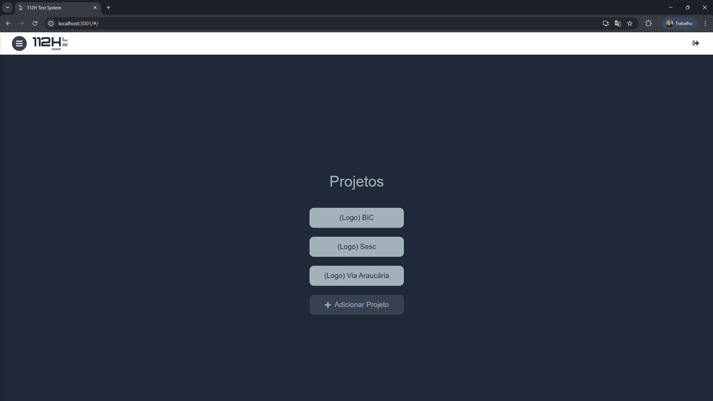
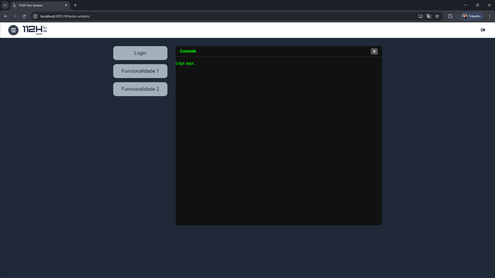

# 112H Test System

  

Aplicação web desenvolvida pela **112H** para execução, monitoramento e gerenciamento de testes dos sistemas desenvolvidos pela empresa. A ferramenta oferece uma interface moderna e responsiva, permitindo aos desenvolvedores acompanhar logs e resultados dos testes em tempo real.

---

## Funcionalidades

* Interface moderna e minimalista baseada em **React** e **Styled Components**.
* Execução de testes de funcionalidades específicas:

  * Login
  * Funcionalidade 1
  * Funcionalidade 2
* Console de logs detalhado durante a execução de cada teste.
* Botão para parar testes em andamento.
* Fechamento rápido do console sem afetar os testes ativos.
* Layout responsivo, garantindo que o console não sobreponha os elementos principais.
* Preparada para integração futura com backend em **Django** / **Python** / **Selenium**.

---

## Capturas de Tela

### Tela Principal


Interface clean com botões para iniciar testes.

### Console de Logs


Visualização detalhada do progresso e logs de execução.

---

## Tecnologias Utilizadas

* [React 18](https://reactjs.org/) – Frontend moderno e reativo
* [Styled Components](https://styled-components.com/) – Estilização modular e dinâmica
* JavaScript ES6+
* CSS responsivo

---

## Pré-requisitos

* [Node.js](https://nodejs.org/) >= 18
* [npm](https://www.npmjs.com/) ou [yarn](https://yarnpkg.com/)
* Navegador moderno (Chrome, Firefox, Edge)

---

## Instalação e Execução

1. Clone o repositório:

```bash
git clone https://github.com/gabrielbap112h/112h-test-system
cd 112h-test-system
```

2. Instale as dependências:

```bash
npm install
```

3. Inicie a aplicação:

```bash
npm start
```

4. Acesse [http://localhost:3000](http://localhost:3000) no navegador.

---

## Roadmap

* Integração com backend em Django/Python/Selenium para execução de testes automatizados.
* Registro e armazenamento centralizado dos logs e resultados de testes.
* Autenticação e suporte a múltiplos projetos simultaneamente.
* Dashboard de métricas de testes com gráficos e relatórios.
